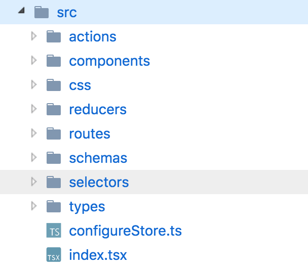

# normalizr / reselect

---

## はじめに

redux を使っているプロジェクトは結構あるが  
store を見てみるとネストが深  かったりして  
reducer での処理が辛かったりと  
しっかり設計されてもるものは少ない

+++

normalizr で api response を正規化して  
reselect でデータを取り出すようにすると  
複雑さの少ないキレイな store ができあがる

---

## [normalizr](https://github.com/paularmstrong/normalizr)

json を正規化するライブラリ

+++

よくある api response

```json
{
  "id": "123",
  "author": {
    "id": "1",
    "name": "Paul"
  },
  "title": "My awesome blog post",
  "comments": [
    {
      "id": "324",
      "commenter": {
        "id": "2",
        "name": "Nicole"
      }
    }
  ]
}
```

+++

そのまま store に保存すると reducer で死ぬ  
例えば commenter の名前に更新があった場合

```javascript
export default (state = {}, action) => {
  switch (action.type) {
    case "UPDATE_COMMENTER_NAME":
      return {
        ...state,
        comments: state.comments.map(comment => {
          if (comment.commenter.id === action.payload.id) {
            return {
              id: comment.id,
              commenter: {
                id: action.payload.id,
                name: action.payload.name // ここが更新
              }
            };
          }
          return comment;
        })
      };
    default:
      return state;
  }
};
```

+++

たぶん、こう  
これであっているかどうかを確認するのも大変

+++

normalizr で store のネストを少なくできる

```javascript
{
  result: "123",
  entities: {
    "articles": {
      "123": {
        id: "123",
        author: "1",
        title: "My awesome blog post",
        comments: ["324"]
      }
    },
    "users": {
      "1": { "id": "1", "name": "Paul" },
      "2": { "id": "2", "name": "Nicole" }
    },
    "comments": {
      "324": { id: "324", "commenter": "2" }
    }
  }
}
```

+++

参照用 id(result) とデータの実体 (entities) に分離  
articles, users, comments を分けて store に格納

+++

UPDATE_COMMENTER_NAME の処理が簡素になる

```javascript
// users だけの reducer
export default (state = {}, action) => {
  switch (action.type) {
    case "UPDATE_COMMENTER_NAME":
      const { id, name } = action.payload;
      return {
        ...state,
        [id]: { id, name }
      };
    default:
      return state;
  }
};
```

+++

どっちがいいかは一目瞭然  
保守性が爆上がりする

+++

本当は api を返す段階で  
正規化されていることが望ましいが  
実際はそうもいかない場面が多い  
クライアント側で正規化して頑張ろう

---

## [reselect](https://github.com/reactjs/reselect)

redux 用のセレクターライブラリ

+++

redux のセレクターとは...  
store から必要な値を取り出すこと

+++

redux でよくあるセレクター

```javascript
const mapStateToProps = state => {
  const someData = state.some.data;
  const filteredData = filterDate(someData);
  const sortedData = sortDate(filteredData);

  return { data: sortedData };
};
```

+++

ダメな点 1

some.data にアクセスする  
components が他にもあった場合に  
同じ記述をいくつも書かないといけない

+++

ダメな点 2

state.some.data とは関係ない  
state の更新であった場合にも  
filter, sort 処理が走る

+++

reselect を使って書き換え

```javascript
const selectSomeData = state => state.some.data;

// prettier-ignore
const selectFilteredSortedData = createSelector(
  selectSomeData,
  someData => {
    const filteredData = expensiveFiltering(someData);
    const sortedData = expensiveSorting(filteredData);
    return sortedData;
  }
);

const mapStateToProps = state => {
  const filteredSortedData = selectFilteredSortedData(state);
  return { data: filteredSortedData };
};
```

@[5](inputSelector)  
@[6-10](outputSelector)

+++

inputSelector が  
以前の state と異なる場合に  
outputSelector が実行される

+++

inputSelector が  
以前の state と同じ場合は  
outputSelector が実行されず  
前回のキャッシュを返す

(Memoized と呼ばれる)

+++

さっきのダメな点が解決される

+++

selector 用のディレクトリを作って運用している



---

## おわりに

normalizr と reselect の  
組み合わせは非常に強力  
store からのデータ抽出が楽になる

+++

normalizr と reselect は  
実は redux 公式でも言及されている  
積極的に使っていこう
